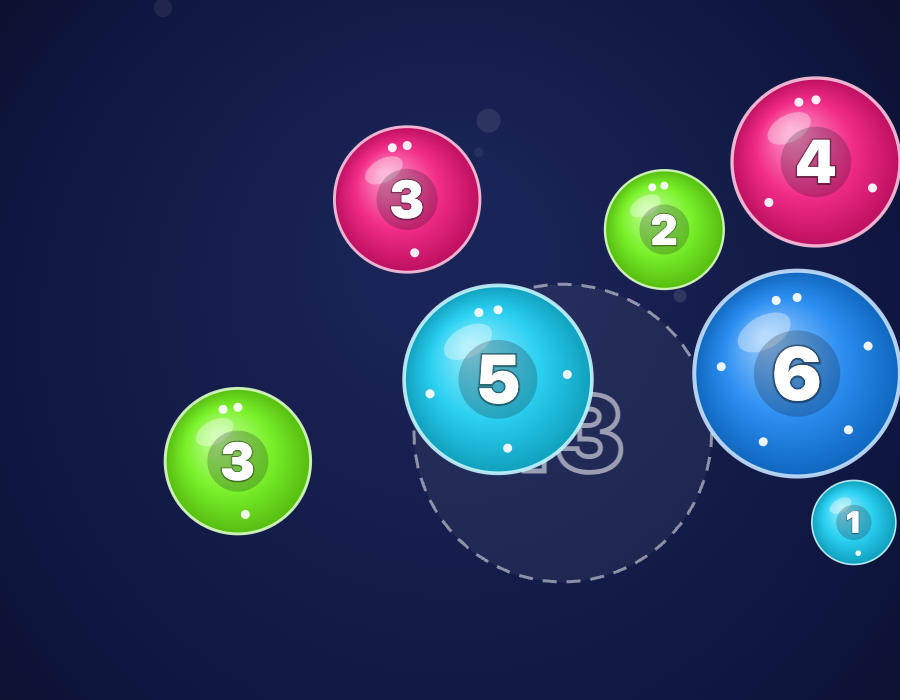

# Bubble Math


```
                         _______________________________________________
                        /                                              /|
                       /  BUBBLE MATH                                 / |
                      /    ════════════                              /  |
                     /     (5) + (6)  ·  (9) − (5)  ·  ⭐ target     /   |
                    /_______________________________________________/    |
                    |     ___         ___         ___                |    |
     ___            |   .'   '.    .'   '.     .-'   '-.             |    |
    (・‿・)          |  ( 3     ) →( merge ) → ( split ) ←╮           |  /
     /||\           |   '.___.'    '.___.'     '-.___.-'    ╰──╮     | /
    /  \            |_______________________________________________|/
```

> Drag to merge. Yank to tear. Nothing commits until you let go.

A one-file, touch-first math toy for a young kid who can read numerals. Bubbles carry numbers 1–50 (numeral primary, dot ring grouped in tens as the countable layer, area proportional to value). Combining bubbles adds; pulling them apart subtracts. Every operation is slow, visible, and abortable, with the equation spelled out as it happens.

Built for a 3-year-old. No build step, no dependencies, no backend — one `index.html` with canvas rendering, physics, and WebAudio tones.

## Screenshot



## Play

**[Play it here](https://ytubecoder.github.io/bubble-math/)**

| Gesture | Result |
|---|---|
| Drag a bubble onto another, let go | Merge (adds) |
| Push a bubble into another with some pace | They latch and slowly blend — «4 + 6» hovers while it can still be undone; pull away to cancel |
| Yank a bubble fast, keep the finger out | It stretches like taffy, shows «9 − 5», and tears; pull distance sets the proportion; bring the finger back to heal |
| Double-tap | Split in half |
| Two fingers on one bubble, spread | Proportional split with a live cut-line preview |
| Drag a matching bubble into the dashed ghost socket | ⭐ celebration, new target appears elsewhere |
| Merge everything into one bubble, leave it alone | Party, then it bursts into ones (≤12) or tens + ones — the new play set |

Corner controls: 🔊 mute, ⭐ target on/off, + add a bubble. Totals are conserved by every interaction.

iPad: open in Safari, Share → Add to Home Screen for a fullscreen, zoom-proof app.

## Run locally

Any static server works:

```bash
python3 -m http.server 4310
```

Open `http://localhost:4310/`.

## Files

- `index.html` — the entire app (canvas rendering, physics, audio via WebAudio, no dependencies)

**Compatible with:** any modern browser · iPad Safari (home-screen app) · [Claude Code](https://claude.ai/code)
